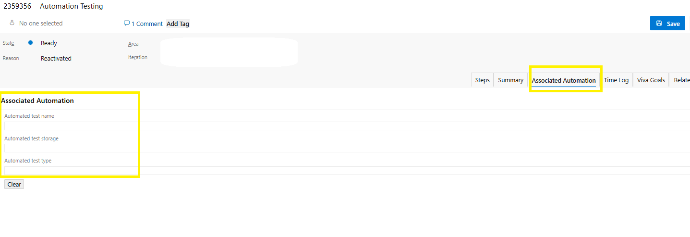
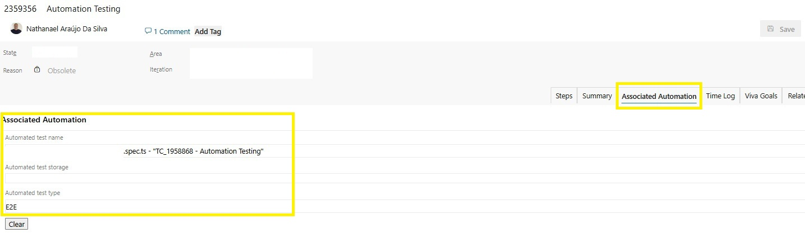
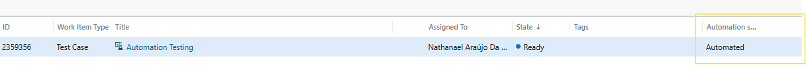
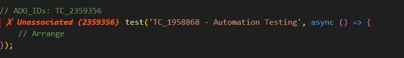

# Streamline Your Test Automation with Azure Test Track VS Code Extension

**Transform your testing workflow by seamlessly connecting automated tests to Azure DevOps Test Cases**

---

## Why This Process Matters: Microsoft's Automation Status Design

### The Hidden Challenge with Azure DevOps Automation Status

Here's something most QAs don't realize: **You cannot manually set the "Automation Status" field to "Automated" in Azure DevOps**. The dropdown only shows "Not Automated" and "Planned" options. So how do test cases get the "Automated" status? Here's the secret:

#### Microsoft's Intelligent Design Philosophy
Microsoft designed Azure DevOps with a specific workflow in mind:

1. **Associated Automation Tab = Source of Truth**
   - The "Associated Automation" tab should contain the actual automation details
   - This tab represents the **real connection** between test cases and automated tests

2. **Automation Status = Calculated Field** 
   - The "Automation Status" field is designed to be **automatically triggered**
   - When you populate the "Associated Automation" tab, Microsoft's internal triggers update the status
   - This ensures the status reflects **actual automation**, not manual changes

3. **Why Manual Updates Don't Work**
   - The "Automation Status" dropdown **only has "Not Automated" and "Planned"**
   - **"Automated" is not a selectable option** - it only appears when triggered by the system
   - You cannot manually mark a test case as "Automated" even if you want to
   - The only way to get "Automated" status is through proper automation association

### The Real Challenge

**How do you actually get a test case to show "Automated" status?**

- ❌ **Try to select "Automated"**: Not possible - option doesn't exist in dropdown
- ❌ **Leave as "Not Automated"**: Doesn't reflect reality of your automation efforts
- ✅ **Populate Associated Automation**: The ONLY way to trigger "Automated" status

### Microsoft's Recommended Workflow

```
📝 Write Automated Test
    ↓
🔗 Populate Associated Automation Tab  
    ↓
⚙️  Microsoft Triggers Update Status
    ↓ 
✅ Automation Status = 'Automated'
    ↓
📋 Full Traceability Maintained
```

### What This Extension Solves

By automatically populating the **Associated Automation tab**, we:

- ✅ **Follow Microsoft's intended workflow**
- ✅ **Trigger the automated status update correctly** 
- ✅ **Maintain complete traceability** from code to test case
- ✅ **Ensure accuracy** - status reflects real automation
- ✅ **Enable verification** - anyone can see the actual test details

> **Key Insight**: This isn't just about saving time - it's about following Microsoft's design pattern to ensure your automation status is **trustworthy, verifiable, and properly integrated** with Azure DevOps' automation tracking system.

---

## The Problem Every QA Faces

As QA professionals, we often struggle with:
- **Manual test case association** in Azure DevOps taking hours
- **Lost traceability** between automated tests and test cases
- **Outdated automation status** in ADO that doesn't reflect reality
- **Time-consuming manual updates** every time we add new tests

**What if there was a better way?**

---

## Introducing Azure Test Track Extension

The Azure Test Track VS Code Extension revolutionizes how you manage test automation by **automatically linking your automated tests to Azure DevOps Test Cases** with just a simple comment.

### What It Does
- **Automatically associates** automated tests with ADO Test Cases
- **Updates automation status** to "Automated" in Azure DevOps
- **Populates Associated Automation tab** with all relevant details
- **Supports multiple languages**: JavaScript, TypeScript, Python, and Gherkin
- **Visual indicators** show which tests are linked vs unlinked

---

## How It Works

### Step 1: Add ADO_IDs Comment
Simply add a comment above your test with the test case IDs:

```javascript
// ADO_IDs: TC_1234, TC_5678
test('User can login with valid credentials', async () => {
  // Your test code here
});
```

### Step 2: Run the Association Command
Use VS Code Command Palette (`Ctrl+Shift+P`) and run:
- `Associate IDs from Comments`

### Step 3: See the Magic in Azure DevOps!

---

## See It In Action

### Before: Manual Test Case Management

*Traditional manual process of updating test cases one by one*

### Azure DevOps Integration Results

#### 1. Associated Automation Tab - Populated Automatically

*The Associated Automation tab is automatically filled with test details*

#### 2. Automation Status Changed to "Automated"

*Test case automation status automatically updated*

### VS Code Integration

#### 1. Visual Indicators in Your Code

[VS Code Decorations](screenshots/vscode-visual-indicators-after.png)
*Green checkmarks show associated tests, red X shows unassociated tests*

---

## Quick Start Guide

### 1. Installation
```bash
# Install from VS Code Extensions Marketplace
# Search for "Azure Test Track"
```

### 2. Setup Environment Variables Globally
```bash
# Required ADO configuration
ADO_ORGANIZATION=your-organization
ADO_PROJECT=your-project
ADO_PERSONAL_ACCESS_TOKEN=your-pat-token
ADO_COMPANY_EMAIL=your-email@company.com
```

### 3. Start Using

**For JavaScript/TypeScript:**
```javascript
// ADO_IDs: TC_1001
test('API returns user data correctly', () => {
  // Test implementation
});
```

**For Python:**
```python
# ADO_IDs: TC_2001
def test_user_authentication():
    # Test implementation
    pass
```

**For Gherkin (.feature files):**
```gherkin
# ADO_IDs: TC_3001
Scenario: User can complete checkout process
  Given user has items in cart
  When user proceeds to checkout
  Then order should be created successfully
```

---

## Pro Tips for QA Teams

### 1. Batch Processing
Associate all tests in a file at once:
```bash
# Use "Associate IDs from Comments" command
# Processes entire file automatically
```

### 2. Visual Verification
Use the decoration feature to see association status:
- ✅ **Green**: Test is associated with ADO
- ❌ **Red**: Test needs association

### 3. Multiple Test Cases
One test can cover multiple test cases:
```javascript
// ADO_IDs: TC_1001, TC_1002, TC_1003
test('Complete user registration flow', () => {
  // Covers validation, creation, and confirmation
});
```

---

## Real Impact on QA Productivity

### Quality Improvements
- ✅ **100% accurate** test case associations
- ✅ **Real-time sync** between code and ADO
- ✅ **Zero manual errors** in test case updates
- ✅ **Complete traceability** from requirement to test

---

## Enterprise Ready

### Security & Compliance
- ✅ Uses Azure DevOps PAT tokens (secure authentication)
- ✅ Respects organization permissions
- ✅ No data stored outside your environment
- ✅ Works with enterprise Azure DevOps instances

### Team Collaboration
- ✅ Consistent test case association across team
- ✅ Standardized ADO_IDs format
- ✅ Visual indicators for code reviews
- ✅ Automated documentation updates

---

## Need Help?

- 📖 **Documentation**: [README.md](README.md)
- 💡 **Examples**: [Code Examples](EXAMPLE_CODE.md)
- 🐛 **Issues**: [GitHub Repository](https://github.com/TheCollegeHub/azure-test-track-vscode-extension)
- 📧 **Contact**: Support team

---

### 🔗 Quick Links
- [Download Extension](https://marketplace.visualstudio.com/items?itemName=araujosnathan.azure-test-track)
- [Full Documentation](README.md)
- [Code Examples](EXAMPLE_CODE.md)
- [GitHub Repository](https://github.com/TheCollegeHub/azure-test-track-vscode-extension)